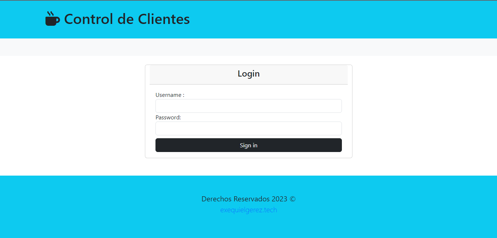
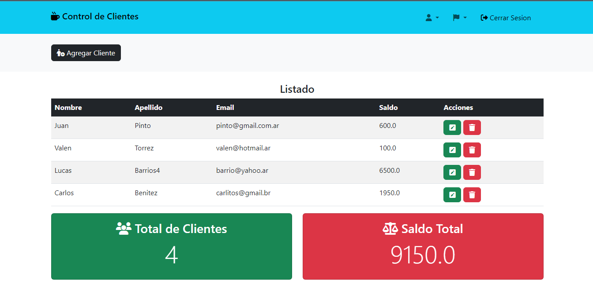
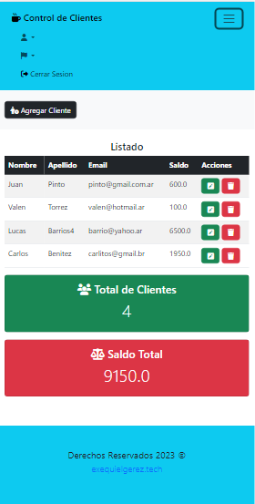
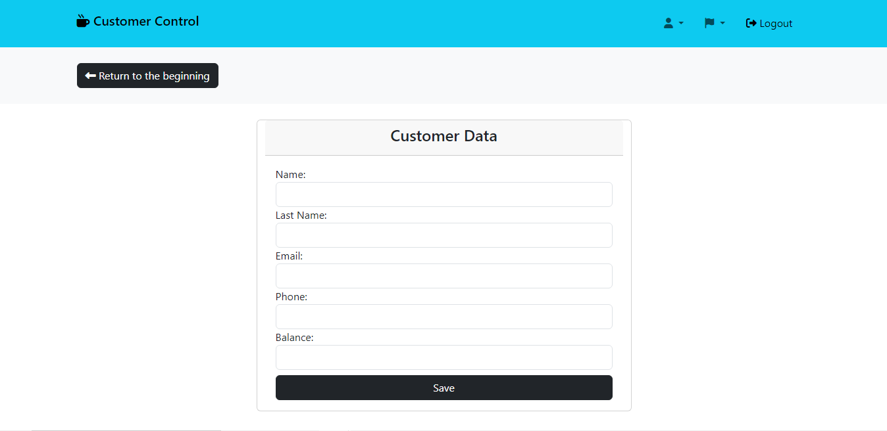
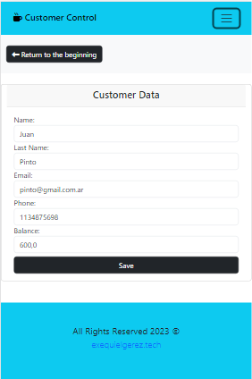

# Control de Clientes - Aplicación Spring Boot con Bootstrap
#  Arquitectura Multicapas 🧑‍🔧 
- Presentación (Thymeleaf / Patrón MVC),
- Negocio (Spring DI / AOP)
- Datos (JPA / Hibernate / MySQL)

---

## 🖥️ Tecnologías Utilizadas:

- Java
- Bootstrap
- Intellij IDEA
- Spring Boot
- Spring Web
- Spring Security
- Spring Data JPA / Hibernate
- MySQL
- Thymeleaf
- Lombok
- Validation  

---
## ⚠️ Importante! ⚠️

☕ Use Java versión 8 o superior para compatibilidad.   
📝 Recomendación: ver el archivo pom.xml para visualizar las dependencias del proyecto.   

---

---

---

---

---

---

## Reference Documentation
For further reference, please consider the following sections:

* [Official Apache Maven documentation](https://maven.apache.org/guides/index.html)
* [Spring Boot Maven Plugin Reference Guide](https://docs.spring.io/spring-boot/docs/3.0.2/maven-plugin/reference/html/)
* [Create an OCI image](https://docs.spring.io/spring-boot/docs/3.0.2/maven-plugin/reference/html/#build-image)
* [Spring Boot DevTools](https://docs.spring.io/spring-boot/docs/3.0.2/reference/htmlsingle/#using.devtools)
* [Spring Web](https://docs.spring.io/spring-boot/docs/3.0.2/reference/htmlsingle/#web)
* [Thymeleaf](https://docs.spring.io/spring-boot/docs/3.0.2/reference/htmlsingle/#web.servlet.spring-mvc.template-engines)

## Guides
The following guides illustrate how to use some features concretely:

* [Building a RESTful Web Service](https://spring.io/guides/gs/rest-service/)
* [Serving Web Content with Spring MVC](https://spring.io/guides/gs/serving-web-content/)
* [Building REST services with Spring](https://spring.io/guides/tutorials/rest/)
* [Handling Form Submission](https://spring.io/guides/gs/handling-form-submission/)

